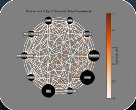
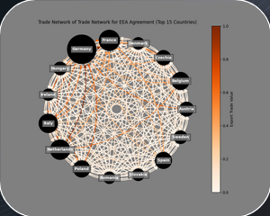
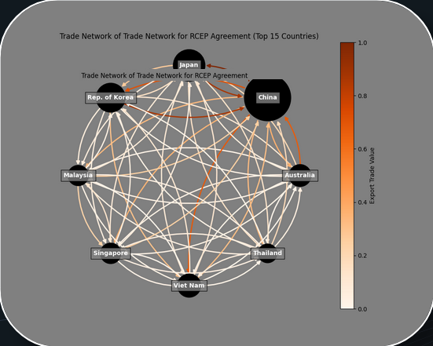
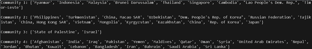
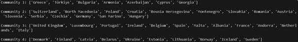

# Network Analysis on Trade Agreements
Dataset found at [cepii](https://www.cepii.fr/CEPII/en/welcome.asp) 
For the Slides Presentation with all the results [Google Slides](https://docs.google.com/presentation/d/1Ony-XhAuKDaJWteTmfyIP0csarFuA_iZ/edit?usp=sharing&ouid=113819025482606470224&rtpof=true&sd=true)
## Hypotheses
- Communities will be structured around trade agreements and continents
- United States and China would be the most central countries
- COVID-19 time period would have a lower modularity, average centralities, and larger diameter
- The graph will display Small-World Network properties.
- With time (disregarding COVID-19), the world will become more interconnected, Increasing modularity, centralities and shrinking diameter. 

## Graph Body
- Nodes: Countries
- Edges: Trades. Edges are directed. An edge exists if a country U exports to a country V.
- Weight: Trade Value in USD
- Edge Colour: The darker the color, the higher Trade Value.
- Node Size: A node scales in size in accordance to the "economy" of a country. Economy defined as the total monetary movement of a country.

## Results
### Top 10 Economies

### Graphs of Trade Agreements

### Communities found using Louvain Algorithm

### Communities by Region
Asian Region 
 
European Region 

As we can see in these samples, communities are well defined within a particular region. For instance, in the Asian Region, all the arab countries are in their own community. Or in the European Region, the communities are divided as North Europe, East Europe, etc... 

