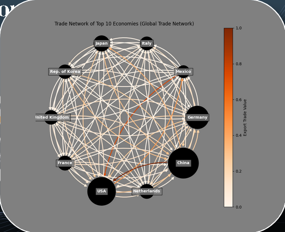

# Network Analysis on Trade Agreements
Dataset found at [cepii](https://www.cepii.fr/CEPII/en/welcome.asp) 

## Hypotheses
- Communities will be structured around trade agreements and continents
- United States and China would be the most central countries
- COVID-19 time period would have a lower modularity, average centralities, and larger diameter
- The graph will display Small-World Network properties.
- With time (disregarding COVID-19), the world will become more interconnected, Increasing modularity, centralities and shrinking diameter. 

## Graph Body
- Nodes: Countries
- Edges: Trades. Edges are directed. An edge exists if a country U exports to a country V.
- Weight: Trade Value in USD
- Edge Colour: The darker the color, the higher Trade Value.
- Node Size: A node scales in size in accordance to the "economy" of a country. Economy defined as the total monetary movement of a country.

## Results

